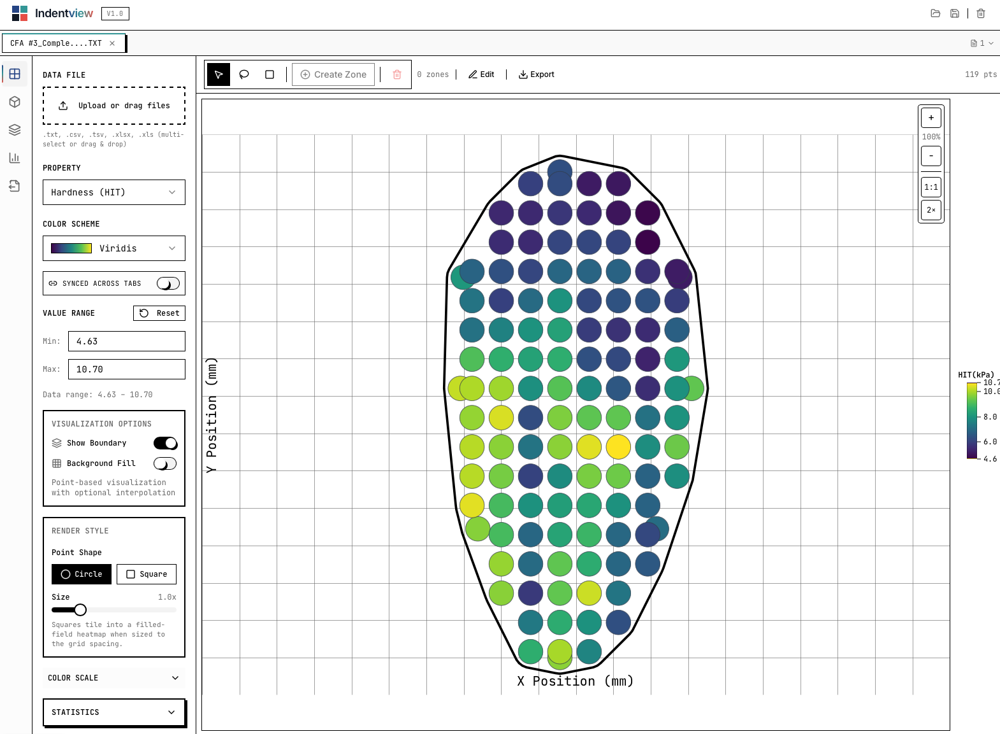

# IndentView

**Visualization and statistical analysis for instrumented indentation data.**

[](https://github.com/rezavtn8/indntviw/actions/workflows/ci.yml)
[](LICENSE)

IndentView reads the matrix exports produced by nanoindentation testers, renders
them as spatial property maps, lets you draw regions of interest directly on the
map, and runs comparative statistics across zones, samples and treatment groups —
then exports publication-ready figures.

It runs entirely in your browser. There is no backend, no account and no upload:
measurement data never leaves the machine it is opened on. That also means it
works offline and on an air-gapped lab computer.



---

## Why this exists

Instrument software is generally good at acquiring data and weak at what comes
after: comparing several samples, defining "the edge" versus "the middle" and
testing whether they differ, and producing a figure a journal will accept.
Exporting to a spreadsheet and rebuilding the analysis by hand each time is slow
and hard to reproduce.

IndentView is the step after acquisition. It is designed around how the work
actually proceeds: load the run, look at the map, mark the regions that matter,
compare them, export the figure.

---

## Quick start

Requires Node.js 18 or newer.

```sh
git clone https://github.com/rezavtn8/indntviw.git
cd indntviw
npm install
npm run dev
```

Then open <http://localhost:8080>. A sample dataset loads automatically, so
there is something to look at before you have your own file ready.

To build a static bundle for deployment:

```sh
npm run build      # output in dist/
```

`dist/` is plain static files — host it anywhere. Configure an SPA fallback
(all routes to `/index.html`), or client-side routes will 404 on refresh.

---

## What it does

**Import** — `.txt`, `.tsv`, `.csv` and `.xlsx` exports. The parser finds the
header row on its own, maps instrument column names to canonical property keys,
survives the mis-encoded micro signs that Windows-1252 exports produce
(`hmax [�m]`, `F/S� [�m�/�N]`), skips the Min/Max/Mean/Std/Median/N summary
block, and handles paired Calibration/Matrix column layouts.

Developed against Anton Paar tester exports. Other instruments are very likely
close enough to work — and if yours doesn't, the parser is deliberately easy to
extend. See [CONTRIBUTING.md](CONTRIBUTING.md#adding-support-for-another-instruments-export-format).

**2D property maps** — Heatmap with optional IDW interpolation and contours,
selectable point shapes and sizing, lasso and box selection, click-to-edit with
undo/redo, IQR-based outlier detection.

**3D** — Point cloud with Delaunay surface mesh, wireframe, per-axis flips.

**Micrograph overlay** — Register the indentation grid against an optical or SEM
image, with independent transforms for the image and point layers, so you can
see which indent landed on which microstructural feature.

**Zones** — Freeform, elliptical and rectangular regions of interest with
α-shape boundaries and per-zone statistics.

**Comparison** — Sample-to-sample, treatment-group and zone-based comparisons.
Every view states its unit of analysis, because pooling every indent from every
sample and pooling one summary value per sample are different experiments and
give different answers.

**Export** — PNG, SVG and PDF figures; batch export of multiple samples to a ZIP
archive; portable `.indentview` workspace files that record the app version that
wrote them.

---

## Statistics

Full documentation of every method, formula and known limitation is in
**[METHODS.md](METHODS.md)**.

Implemented: descriptive statistics with exact-t confidence intervals,
Shapiro–Wilk normality (Royston AS R94), Welch's t-test, Mann–Whitney U,
one-way ANOVA, Kruskal–Wallis with tie correction, Cohen's d and Hedges' g,
Holm–Bonferroni corrected pairwise post-hoc, Pearson and Spearman correlation,
Moran's I with the Cliff & Ord randomisation variance.

Distribution functions are computed exactly — regularized incomplete beta and
gamma — rather than approximated by the normal distribution.

**Verify it yourself:**

```sh
npm run verify:stats
```

This checks Kruskal–Wallis against chi-squared reference values, Student's t at
several degrees of freedom, inverse-t critical values against published tables,
Shapiro–Wilk against Royston's own test vector, Holm monotonicity, and
confidence-interval width. It runs in CI on every push.

If you are going to publish a number this tool produced, run that command first.
It takes two seconds and it is the difference between trusting the software and
hoping.

### Known limitations

Stated plainly, because an unstated limitation is the dangerous kind:

- Spatial statistics are O(n²) on the main thread — roughly 2.2 s at 10,000
  indents, quadratic beyond. Fine for quasi-static matrices, not yet suitable
  for high-speed mapping runs of 10⁴–10⁵ indents.
- Interpolation is inverse-distance weighting: bullseye artefacts around
  isolated points, and no uncertainty estimate. All reported statistics are
  computed from measured points only, never from interpolated values.
- `Ra`/`Rq`/`Rz` are height scatter of the indent Z positions, **not** ISO 4287
  surface roughness. Comparable between samples measured the same way; not
  comparable to profilometer or AFM values.
- Mann–Whitney uses the normal approximation without a continuity correction,
  so it is slightly liberal below n = 10.

---

## Project layout

```
src/
  components/
    analysis/       comparison and statistics panels
    controls/       sidebar controls
    export/         figure export options
    layout/         app shell
    panels/         contextual side panels
    visualization/  heatmap, 3D scene, overlay, export canvas
  contexts/         session, visualization, zones, editor state
  types/            data model
  utils/            parsing, statistics, geometry, export
scripts/
  verify-statistics.ts    reference-value checks, run in CI
```

Built with React, TypeScript, Vite, three.js and Tailwind.

---

## Contributing

Contributions are welcome — particularly sample exports from instruments other
than Anton Paar, which is the fastest way to make the parser useful to more
people. See [CONTRIBUTING.md](CONTRIBUTING.md).

One rule worth repeating here: **changes to statistical methods must come with a
check against a published reference value.** An earlier version of this project
computed the chi-squared CDF with the t-distribution's formula, making every
Kruskal–Wallis p-value wrong by up to 30×, and nothing caught it because nothing
was checking. See [CHANGELOG.md](CHANGELOG.md) for the full list of corrections
made in 2.3.

---

## Citing

If IndentView contributes to published work, please cite the repository and
state the version (shown in the app header, and recorded in saved workspace
files). Results from before 2.3 are not comparable to results after it — the
changelog explains why.

---

## License

[MIT](LICENSE) © Mohammadreza Vatankhah
